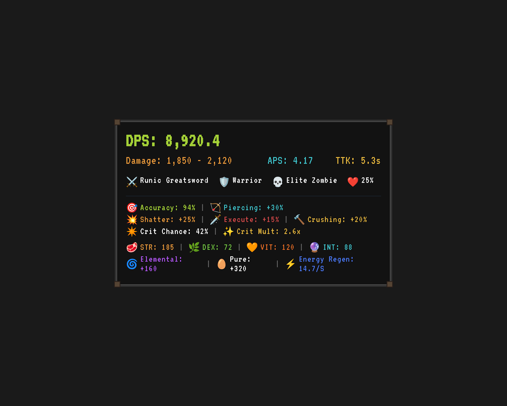

# MinMax Realms

Client-side Fabric mod for Minecraft `1.21.5` focused on DungeonRealms quality-of-life and theorycrafting.

## Beta Notice

MinMax Realms is still in beta.

Some parts of the mod are already very usable, but a few systems are still being refined, especially the stamina / energy-side assumptions used by the DPS simulator. I am still validating how stamina behaves in practice so the formulas and options will become smoother over time.

If something feels off, awkward, or unclear, please do not hesitate to leave feedback.

## Features

- `DR Item Rolls`
  - Detects item rarity from the visible tooltip
  - Shows roll quality inline for supported weapon and armor stats
  - Can clean up durability, item id, and component lines

- `DR DPS Meter`
  - Simulates theoretical DPS from your weapon, gear, class, and target tier
  - Includes DungeonRealms-specific stats such as crit, shatter, execute, crushing, piercing, and energy sustain

- `Gem Meter`
  - Tracks gems with a lightweight HUD

## Screenshots

### DPS Meter



## Controls

The mod registers a dedicated category in Minecraft `Controls`.

Default keys:

- `O` opens the config screen
- extra toggle keys for `DPS Meter`, `Gem Meter`, and `Item Rolls` can be set in `Controls`

## Config

The config is stored in:

`config/dr-standalone.json`

You can configure feature toggles, HUD placement, DPS simulation settings, item roll display style, and tooltip cleanup options.

## Build

```powershell
.\gradlew.bat build
```

Built jar:

`build/libs/minmax-realms-1.21.5-local.jar`

Exported workspace jar:

`../build/minmax-realms-1.21.5-local.jar`

## Notes

- This is a client helper mod, not a hacked client
- The DPS meter is a theorycraft tool, not a live combat parser
- Roll detection is based on visible tooltip text plus bundled DR datasets
- The stamina model is still being tuned and verified in beta
