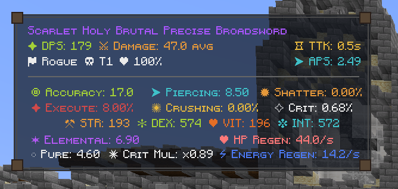
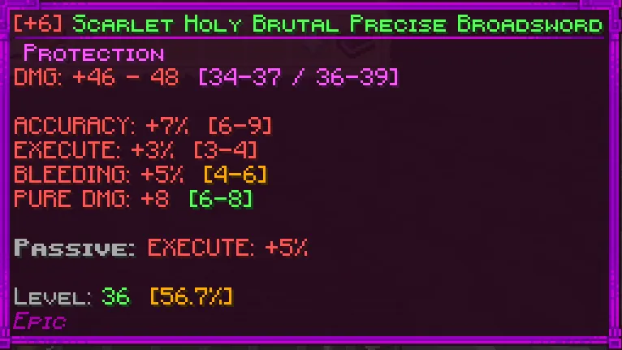
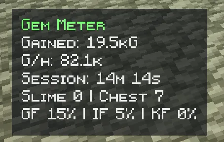
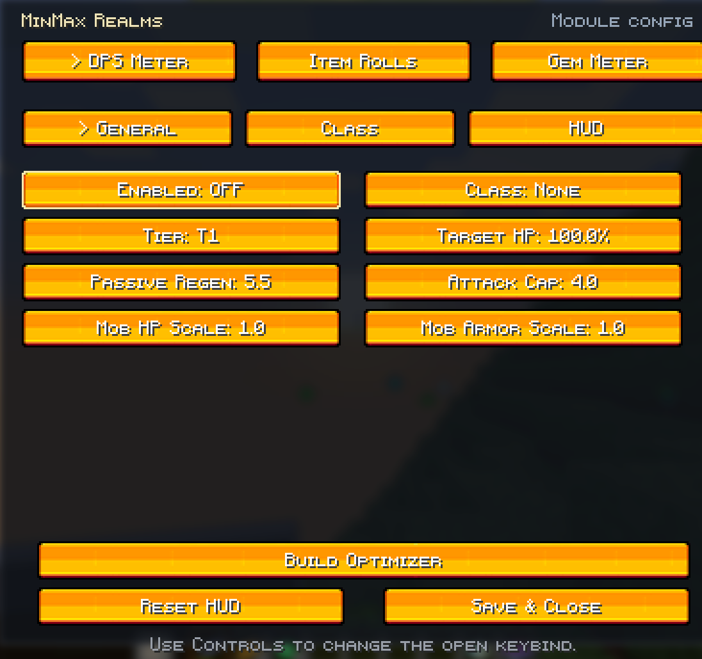
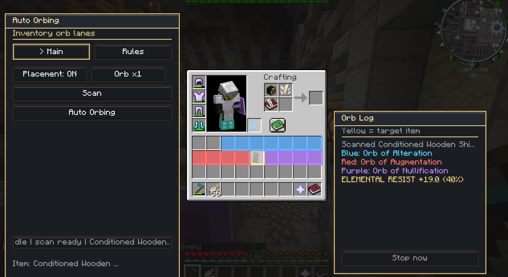
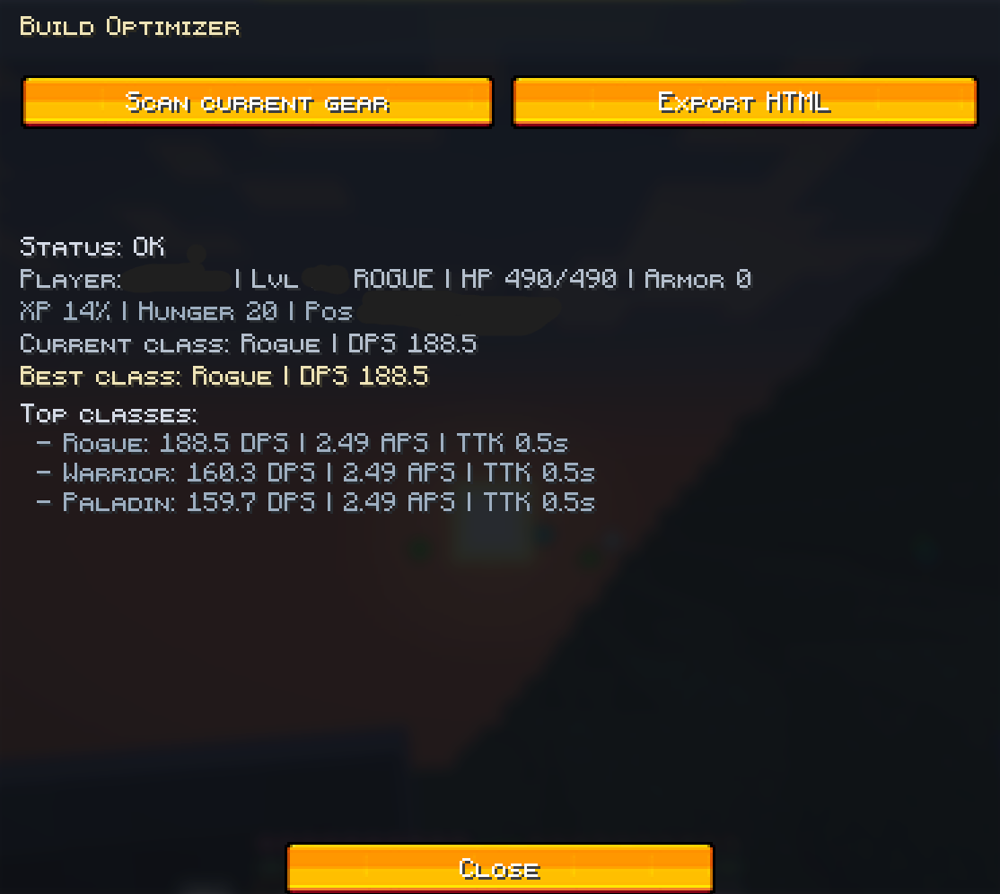
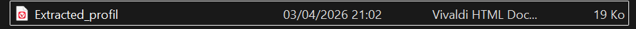
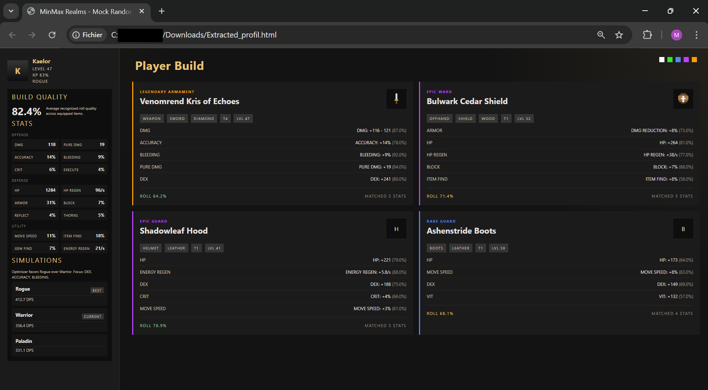

# MinMax Realms

Client-side Fabric mod for Minecraft `1.21.5` focused on DungeonRealms quality-of-life and theorycrafting.

## Beta Notice

MinMax Realms is still in beta.

Some parts of the mod are already very usable, but a few systems are still being refined.

If something feels off, awkward, or unclear, please do not hesitate to leave feedback.

Auto-augment is planned 
Auto-orbing is planned

## Features

- `DR Item Rolls`
  - Detects item rarity from the visible tooltip
  - Shows roll quality inline for supported weapon, armor, shield, and many custom set stats
  - Handles enchant-added stat suffixes without breaking roll quality detection
  - Supports special rarity handling such as `Transmuted`
  - Can clean up durability, item id, and component lines

- `DR DPS Meter`
  - Simulates DPS from your weapon, gear, class, and target tier
  - Uses tier-scaled stamina cost by weapon family
  - Includes a melee session model with configurable `Melee APS`
  - Includes DungeonRealms-specific stats such as crit, shatter, execute, crushing, piercing, and energy sustain

- `Gem Meter`
  - Tracks session gem gains with a lightweight HUD
  - Supports `Inventory`, `Chat`, or `Hybrid` sources
  - Shows `Gem Find`, `Item Find`, and `Key Find`
  - Tracks slime kills and opened chests during the session
  - Supports custom rule counters with user-defined titles and chat keyword parsing

- `Build Optimizer`
  - Scans your equipped gear and compares simulated DPS across class profiles
  - Exports a standalone HTML build sheet with player snapshot, item cards, and grouped stats
  - Keeps the in-game flow simple with `Scan current gear` and `Export HTML`

- `AutoAugment`
  - Adds an in-inventory smith overlay for Weaponsmith and Armorsmith workflows
  - Supports single augment, looped auto augment, attempts slider, rule matching, and live roll logs
  - Includes a dedicated preview screen from the config menu for faster UI iteration

- `Auto-Orbing`
  - Adds a dedicated orb workflow overlay with fixed placement mapping and colored slot guides
  - Supports `Orb x1`, full auto-run, rule matching, roll-percent thresholds, and chat logging
  - Includes a preview screen plus a rules tab for temporary stat targeting

- `Codex + Stats Wiki`
  - Browse indexed DR custom items from the bundled stats database
  - Search and filter by name, slot, and rarity
  - Includes a built-in wiki explaining roll quality and stat categories

- `HTML Export`
  - Export optimizer analysis to a standalone HTML report
  - Saves reports directly to `Downloads`
  - Still updates `build-latest.html` under `config/dr-standalone/exports` for quick reuse/testing

## Screenshots

### DPS Meter



### DR Item Rolls



### Gem Meter



### Module Config



### AutoAugment UI



### Auto-Orbing UI


### AutoAugment / Auto-Orbing Config

The standalone config screen now includes dedicated sections for:

- `DPS` with `General / Class / HUD`
- `Item Rolls` with `General / Debug`
- `Gem Meter` with split sub-tabs for `General`, `HUD`, `Gems`, `Slimes`, `Chests`, and custom rules
- `AutoAugment` preview
- `Auto-Orbing` preview and runtime settings

### Build Optimizer



### HTML Export File



### HTML Export Preview



### Build Optimizer / Codex

The optimizer and codex screens are available in-game from the config screen.

## Controls

The mod registers a dedicated category in Minecraft `Controls`.

Default keys:

- `O` opens the config screen
- `K` opens the `Codex + Stats Wiki` screen
- extra toggle keys for `DPS Meter`, `Gem Meter`, and `Item Rolls` can be set in `Controls`

## Config

The config is stored in:

`config/dr-standalone.json`

You can configure feature toggles, HUD placement, DPS simulation settings, item roll display options, gem parsing rules, AutoAugment preview access, and Auto-Orbing runtime settings.

## UI Theme

The mod now uses a higher-contrast charcoal + gold UI pass for the custom overlays and config screens.

- AutoAugment and Auto-Orbing are styled directly in code so the rest of Minecraft stays untouched
- The config screen has been reworked to match the same visual language
- The theme is built to stay readable at Minecraft's native UI scale without blur or shader effects

## Build

```powershell
.\gradlew.bat build
```

Built jar:

`build/libs/minmax-realms-v0.4.0-mc1.21.5.jar`

Exported workspace jar:

`../build/minmax-realms-v0.4.0-mc1.21.5.jar`

## Notes

- This is a client helper mod, not a hacked client
- The DPS meter is a theorycraft tool, not a live combat parser
- Roll detection is based on visible tooltip text plus bundled DR datasets
- Melee DPS now uses a session-style stamina model; bow behavior still needs a dedicated cadence model
